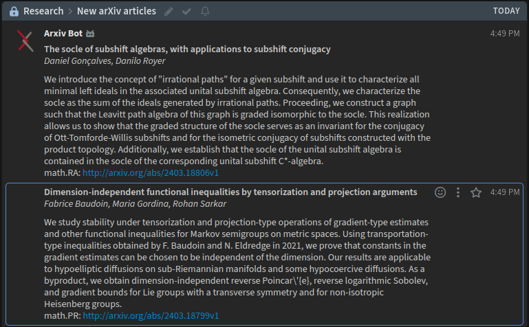

# Arxiv-to-Zulip bot

## How to Setup
1. Create a generic bot in your Zulip Organization
2. Add the new bot to the stream where you want the arXiv updates
3. Get the bot's API key from Personal Settings >> Bots
4. Fork this repository
5. Add bot's email ID and API key to your repository secrets
  - For this go to your repository settings >> Secrets and Variables >> Actions >> New repository secret
  - Add `ZULIP_SITE` as the `https://yourdomainname.zulipchat.com` (replace `yourdomainname` with your domain name)
  - Add `ZULIP_EMAIL` as the email id for the bot
  - Add `ZULIP_API_KEY`. This you can get from the bot settings in zulip
6. Change `ARXIV_CATEGORIES` to your required categories in `main.py`

